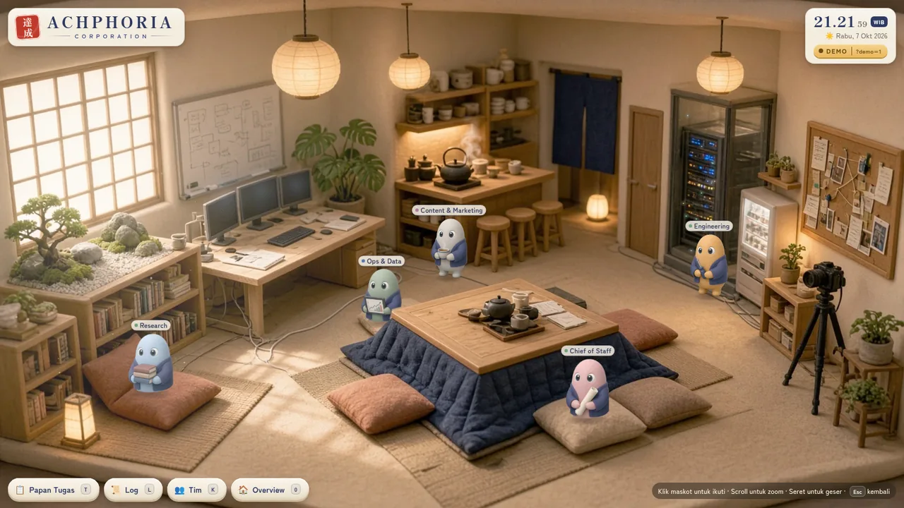

# 🏮 ACHPHORIA CORPORATION — Kantor Virtual (gaya Jepang)

Kantor virtual **LIVE** untuk ACHPHORIA CORPORATION: sebuah kantor mungil bergaya Jepang, seperti rumah boneka dari clay yang dipotong melintang dan dilihat dari atas serong. Lima maskot clay berbentuk kacang (satu per divisi, memakai jaket *happi* indigo) bekerja, rapat di kotatsu, menyeduh teh, makan ramen, jajan di vending machine, dan tidur siang di tatami. Semua gerakan mereka disinkronkan **realtime** dengan Supabase.



- **Kantor 3D (v5, denah B "koridor"):** diorama 3D real-time (Three.js) dilihat dari atas serong seperti rumah boneka: 5 ruang divisi berjajar di satu koridor engawa — Perpustakaan Research (rak buku, tatami), Ruang Monitor Ops & Data (dinding layar grafik), Ruang Chief of Staff paling besar di tengah (meja Chief, shoji, kakejiku, **kotatsu rapat 20 bantal**), Studio Content (kamera tripod, ring light, corkboard), Ruang Server Engineering (rak server ber-LED) — plus Ruang Bersama memanjang di bawah (stasiun teh, konter ramen, papan tulis, tatami, vending, sofa). Tiap ruang divisi punya **1 meja kepala + 3 meja admin** (kosong dulu; lampu menyala bila ada yang duduk) dan noren berwarna divisi + kanji di pintu. Di sekeliling gedung ada **taman Jepang**: gerbang merah 達成 dengan jalan batu pijakan, kolam koi, taman batu kerikil, sakura (kelopak berguguran), momiji, pinus, bambu, lentera batu, pagar tanaman.
- **Karakter:** maskot kacang clay 3D berjaket *happi* indigo (warna badan = warna divisi), bayangan asli, berjalan lewat pintu & koridor dan menghindari meja/kotatsu. Agen offline keluar lewat pintu taman dan menunggu redup di dekat gerbang. Gambar maskot 2D tetap dipakai untuk avatar di sidebar.
- **Animasi:** jalan melompat dengan *squash & stretch*, napas pelan saat diam, kedip mata, getar mengetik di meja, duduk di bantal atau bangku, tidur berbaring dengan "z", serta emote 💬 ☕ 🍜 💡 🥤 yang memantul di label agen.
- **Suasana yang bereaksi pada data & waktu:** layar grafik Ops bergulir & lebih terang saat Ops & Data bekerja di mejanya, LED rak server berkedip lebih cepat saat Engineering bekerja, ring light studio menyala saat Content bekerja, lampu meja menyala bila mejanya terisi, lampion besar di atas kotatsu berdenyut saat ada rapat, uap teh/ramen menebal saat ada yang di sana, papan tulis **"HARI INI · 本日"** menampilkan jumlah tugas *sedang kerja / terjadwal / selesai hari ini*. Cahaya matahari, lampion, dan lentera taman berubah siang/senja/malam menurut jam WIB.
- **Tata letak (v3):** *top bar* ramping (wordmark + hanko 達成 di kiri, ringkasan tim seperti "3 kerja · 1 meeting · 1 istirahat" di tengah, jam WIB + tanggal + badge **LIVE/DEMO** di kanan), panggung kantor yang **selalu memenuhi ruang** (cover-fit: tepi dipotong, tidak pernah ada bar kosong; geser & zoom dibatasi supaya tidak ada area kosong), dan **sidebar dasbor** kertas washi di kanan (≈330–384 px). Di HP sidebar menjadi *bottom sheet* yang bisa ditarik/ketuk untuk dibesarkan.
- **Sidebar dasbor:** (a) 5 kartu agen — avatar maskot, nama divisi, pill status berwarna (Kerja / Meeting / Istirahat / Santai / Terjadwal / Offline), lokasi, aktivitas + tugas satu baris, "update 4 mnt lalu"; klik kartu = zoom & ikuti agen, kartu agen yang diikuti disorot dan **membuka detail** (tugas, log terbaru, tombol tutup) menggantikan kartu detail melayang lama; (b) **Ringkasan hari ini**: Sedang kerja / Terjadwal / Selesai hari ini + bar progres; (c) **Log langsung**: 8 entri terbaru, entri baru masuk dengan animasi.
- **Label di panggung:** tiap maskot punya label nama + gelembung aktivitas singkat (emoji + 2–4 kata, mis. "📊 pantau data", "🍵 istirahat teh", "💬 meeting", "🚶 menuju kotatsu"). Label digambar tajam di ruang layar dan didorong agar tidak saling tumpuk saat agen berkumpul (dengan garis penunjuk bila bergeser jauh).
- **UI (Bahasa Indonesia, jam WIB):** kertas washi, aksen indigo, tombol clay. Papan Tugas (`T`), Log lengkap (`L`), daftar Tim (`K`), tooltip, badge LIVE/DEMO (klik untuk alasan).

## Agen (v2)

| id | Nama tampilan | Warna | Properti | Zona "desk" |
|---|---|---|---|---|
| `chief` | Chief of Staff | rose pudar `#d98c8c` | gulungan | meja Chief (ruang tengah) |
| `research` | Research | biru langit `#8fb8de` | tumpukan buku | Perpustakaan |
| `ops` | Ops & Data | sage `#8fae8b` | tablet grafik | Ruang Monitor |
| `content` | Content & Marketing | abu hangat `#a8a29a` | secangkir teh | Studio Konten |
| `engineering` | Engineering | amber `#e0a64a` | obeng | Ruang Server |

Nama, divisi, dan warna bisa diubah di tabel `ach_agents`. Maskot dipilih berdasarkan `id`.

## Fitur

| Fitur | Cara pakai |
|---|---|
| Ikuti agen | Klik maskot, kartu agen di sidebar, item log / Papan Tugas / daftar Tim, atau tombol `1`–`5`. Kamera zoom lalu mengikuti agen, dan kartunya di sidebar membuka detail. |
| Kembali ke overview | `Esc`, klik area kosong, tombol ✕ Tutup di kartu, klik kartu yang sama, atau `0` |
| Zoom & geser | Scroll untuk zoom di sekitar kursor, seret untuk menggeser. Saat mengikuti agen, scroll mengatur level zoom. |
| Papan Tugas | `T`. Tiga kolom: **Sedang kerja · Terjadwal · Selesai** |
| Log aktivitas | 8 terbaru selalu di sidebar; `L` / "Semua" membuka log lengkap. Entri baru muncul dengan animasi, waktu dalam WIB |
| Tim | Selalu terlihat di sidebar; `K` membuka daftar Tim versi besar (dengan nomor tombol) |
| Tooltip | Arahkan kursor ke maskot atau fasilitas (kotatsu, stasiun teh, vending, …) |
| Parameter URL | `?demo=1` memaksa mode demo · `?jam=21` pratinjau pencahayaan jam tertentu · `?debug=1` menampilkan halangan meja, pintu, titik bernama & rute maskot · `?hidup=cepat` mempercepat semua timer perilaku maskot ±10× (untuk uji) · `?hidup=tenang` mensimulasikan *reduced motion* |

## Maskot hidup (v4)

Semua perilaku ini **murni visual di browser**: tidak pernah menulis ke database, dan **lokasi/status resmi dari data selalu menang**. Sidebar, log, dan Papan Tugas hanya menampilkan data resmi; label di atas maskot boleh menampilkan detour sementara (mis. "sedang ambil teh").

| Perilaku | Keterangan |
|---|---|
| Animasi idle | Tiap maskot punya jadwal acak sendiri (tidak pernah serempak): lirik kiri/kanan, menguap, peregangan tangan, angguk sambil mengetik, menyeruput. Kebiasaan khas: **Research** membalik halaman buku, **Ops** mengetuk/menggeser tablet, **Chief** membuka & membaca gulungan, **Content** menyeruput teh atau pose jepret kamera, **Engineering** memutar obeng. |
| Jalan-jalan | Tiap ±2–6 menit (acak per agen) seorang agen bisa jalan ke stasiun teh, vending, papan tulis, jendela, atau menyamperi rekan untuk ngobrol. Ia diam 10–40 dtk, lalu kembali. Maksimal 2 agen pergi sekaligus (1 di malam hari). Agen offline, yang sedang rapat, atau sedang tidur siang tidak ikut. Status *kerja* lebih jarang jalan-jalan daripada *istirahat/santai*. Jika data berubah di tengah jalan, detour dibatalkan dan maskot langsung menuju lokasi resminya. |
| Interaksi | Agen yang berdekatan saling menghadap, melambai 👋, lalu bergantian memunculkan gelembung kecil (💬 😄 💡 ☕). Di kotatsu (≥2 agen), satu agen mendapat giliran bicara (gelembung + sedikit memantul) sementara yang lain menoleh dan mengangguk. |
| Reaksi data | Dari realtime maupun demo: tugas menjadi **Selesai** → lompat gembira + ✨ + konfeti kecil; tugas baru / menjadi **Sedang kerja** → ❗ di atas label; baris log baru → 📝 kecil. |
| Kantuk | Jika agen tidak mengirim update > 45 menit (tapi belum lewat `STALE_HOURS`), idle-nya melambat, sesekali terkantuk-kantuk 💤 lalu tersentak bangun ❕. Lewat `STALE_HOURS` tetap kembali ke jadwal fallback seperti biasa. |
| Ritme WIB | Pagi 06–11: jalan lebih cepat & lebih sering jalan-jalan · 11.30–13.30: cenderung ke konter ramen · ±15.00: cenderung jajan di vending · setelah 19.00: gerak lebih pelan, lebih sering menguap, jarang jalan-jalan. |
| Reduced motion | Jika OS/browser meminta *prefers-reduced-motion*: tanpa jalan-jalan, tanpa lompatan/konfeti, animasi idle jarang & halus. |


```
index.html                    halaman utama
config.js                     URL + publishable key Supabase (AMAN untuk publik)
css/style.css                 gaya UI (washi, indigo, tombol clay)
assets/                       5 maskot (+ varian mata tertutup) untuk avatar, favicon, preview README;
                              gambar latar 2D lama (kantor-bg, kotatsu, lampion) tidak dipakai lagi sejak v5
js/util.js                    utilitas, format waktu WIB
js/profiles.js                5 agen, kunci ruangan, status, jadwal fallback WIB
js/assets.js                  pemuat gambar + pose duduk yang dibuat di kode
js/world.js                   denah B: ruang, koridor, pintu, meja, kotatsu, fasilitas, titik bernama, rute antar-ruang
                              (menghindari meja), area tooltip
js/sim.js                     simulasi agen: rute, reservasi kursi, pose, squash & stretch, emote,
                              animasi idle (lirik, menguap, peregangan, kebiasaan khas), detour visual
js/life.js                    "maskot hidup": ritme jam WIB, jalan-jalan, obrolan, giliran bicara rapat,
                              reaksi data (✨ ❗ 📝), kantuk, partikel kilau/konfeti
js/fx.js                      fase hari (jam WIB) & papan "Hari ini"
js/data.js                    Supabase LIVE + fallback DEMO (+ deteksi database v1)
js/scene3d.js                 diorama 3D (Three.js r128): kantor, taman, maskot 3D, efek data, cahaya siang/malam, kamera
js/app.js                     loop render, kamera (overview / ruang / taman / ikuti agen), label + gelembung aktivitas, top bar,
                              sidebar dasbor (kartu agen, ringkasan, log langsung), panel T/L/K
supabase/schema.sql           skema LENGKAP v2 untuk instalasi baru (idempotent, prefix ach_)
supabase/migrate-v2-kantor.sql migrasi database v1 (markas bulan, 9 agen) → v2
tools/report.mjs              CLI laporan (Node 18+, tanpa dependensi)
tools/report.py               CLI laporan (Python 3, stdlib saja)
tools/ach.mjs                 CLI jembatan Telegram untuk asisten (lihat "Jembatan Telegram (v3)")
supabase/functions/ach-bridge Edge Function jembatan Telegram (Deno)
supabase/migrate-v3-telegram.sql tabel privat jembatan Telegram
supabase/migrate-v4-logs.sql  grup Telegram ACHPHORIA LOGS (role chat + ach_tg_logmsg)
.nojekyll                     supaya GitHub Pages menyajikan file apa adanya
```

### Aset

Tidak ada generator gambar yang dipakai. Semua aset dibuat dari dua gambar referensi:

- **Latar:** ilustrasi kantor diperbesar 2× (EDSR super-resolution) menjadi 2560×1440 WebP. Lampion dipotong menjadi sprite terpisah supaya bisa bergoyang, dan dinding di belakangnya di-*inpaint*. Bagian depan kotatsu (meja + selimut) dipotong dengan alpha untuk efek oklusi.
- **Maskot:** dipotong dari lembar maskot, latar belakangnya dihapus dengan `rembg` (model isnet-general-use). Untuk tiap maskot dibuat juga varian **mata tertutup** (mata di-*inpaint* lalu digambar garis lengkung) yang dipakai saat kedip dan tidur.
- **Pose dibuat di kode:** *idle* (napas), *jalan* (lompat + squash & stretch + miring + balik arah), *duduk* (kaki dipotong dengan alas membulat), *bangku* (duduk dengan tinggi dudukan), *tidur* (diputar berbaring di atas bantal kecil, mata tertutup, "z").

## Setup

### 1. Supabase

**Instalasi baru:** buka **SQL Editor**, tempel isi [`supabase/schema.sql`](supabase/schema.sql), lalu **Run**. Skrip ini aman diulang dan membuat:
- tabel `ach_agents`, `ach_tasks`, `ach_logs` (+ index, trigger `updated_at`)
- RLS aktif: publik (anon/authenticated) **hanya bisa SELECT**
- fungsi `ach_report_activity(...)` (SECURITY DEFINER, EXECUTE **hanya** untuk `service_role`, memvalidasi id/lokasi/status v2)
- tabel ach_* masuk ke publikasi `supabase_realtime`
- 5 agen v2 + contoh tugas dan log (data yang sudah ada tidak ditimpa)

**Sudah pakai v1 (markas bulan, 9 agen)?** Jalankan [`supabase/migrate-v2-kantor.sql`](supabase/migrate-v2-kantor.sql) **sekali** di SQL Editor. Skrip ini idempotent, berjalan dalam satu transaksi, dan hanya menyentuh objek `ach_*`:

1. Kalau data v1 terdeteksi, skrip **menghapus** baris seed 9 agen lama (`commander`, `engineering`, `research`, `marketing`, `content`, `sales`, `finance`, `success`, `hr`) beserta tugas dan log mereka. Agen v1 `engineering`/`research`/`content` dikenali dari nama lamanya (Engineer/Researcher/Creator), jadi agen v2 dengan id yang sama tidak ikut terhapus kalau skrip diulang.
2. Lokasi lama milik agen lain yang tersisa dikosongkan (mereka lalu memakai jadwal otomatis).
3. CHECK constraint lokasi dan status diganti dengan kunci v2.
4. Lima agen v2 dimasukkan. Kalau id sudah ada, hanya nama/divisi/warna/urutan yang dirapikan.
5. Contoh tugas dan log ditambahkan untuk 5 agen, hanya kalau mereka belum punya.
6. Fungsi `ach_report_activity` diganti dengan validasi v2.
7. RLS, policy SELECT publik, grant, dan publikasi realtime ditegaskan ulang.
8. Diakhiri dengan `notify pgrst, 'reload schema'`.

Sebelum migrasi dijalankan, website tetap tampil dalam **DEMO** dengan badge `DEMO | DB v1`. Klik badge untuk melihat alasannya. Begitu 5 agen v2 ada dan tidak ada lagi agen v1, website **otomatis pindah ke LIVE** (dicek tiap 30 detik).

### 2. `config.js`

```js
window.ACH_CONFIG = {
  SUPABASE_URL: 'https://xxxx.supabase.co',
  SUPABASE_ANON_KEY: 'sb_publishable_xxxxxxxx',   // publishable/anon — aman di browser
  ...
};
```

> ⚠️ **PENTING:** `service_role` / secret key (`sb_secret_…`) **JANGAN PERNAH** ditaruh di `config.js`, di HTML, atau di repo ini. Key itu memberi akses penuh dan melewati RLS. Simpan hanya di lingkungan agen/server (env var, secret manager).

### 3. GitHub Pages

*Settings → Pages*: *Deploy from a branch* → **`main`** / **`/ (root)`**. Website: `https://achphoria.github.io/achphoria-corporation/`.
Untuk menjalankan lokal tanpa build: `python3 -m http.server 8000`.

## LIVE vs DEMO

- Saat dibuka, website langsung tampil dalam **DEMO** (data simulasi) sambil mencoba konek ke Supabase.
- Kalau `ach_agents` bisa dibaca **dan** berisi kelima agen v2 (tanpa agen v1), badge berubah jadi **● LIVE**. Website lalu subscribe ke Realtime (`postgres_changes` pada `ach_agents`, `ach_tasks`, `ach_logs`), dengan refresh penuh tiap 60 detik sebagai cadangan.
- Website tetap di DEMO, dengan alasan singkat di badge, kalau: `config.js` kosong, tabel belum ada, tabel kosong, database masih v1, agen v2 belum lengkap, atau query gagal. Koneksi dicoba ulang tiap 30 detik.

## Ruangan (kolom `location`)

| Kunci | Tempat | Yang terjadi |
|---|---|---|
| `desk` | meja kepala di ruang divisi sendiri (agen tambahan memakai meja admin) | duduk di bantal; mengetik (getar kecil) atau membaca |
| `meeting` | kotatsu di Ruang Chief, 20 bantal (Chief selalu di kepala meja) | duduk; bergantian bicara 💬 |
| `tea` | stasiun teh (kyusu beruap) | berdiri di konter, menyesap ☕ |
| `ramen` | konter ramen, 3 bangku (+2 tempat berdiri) | duduk di bangku, menyeruput 🍜 |
| `tatami` | pojok tatami (2 tempat) | berbaring di bantal kecil, mata tertutup, "z" |
| `vending` | vending machine | jajan 🥤 |
| `whiteboard` | papan tulis | corat-coret ide 💡 |
| `offline` | gerbang taman | keluar lewat pintu taman, melambai 👋, lalu redup di dekat gerbang |

Kunci yang tidak dikenal dianggap `desk`. Agen dengan status `offline` selalu berada di gerbang taman. Saat lokasi berubah, maskot berjalan: keluar pintu ruangnya → koridor engawa → masuk pintu ruang tujuan, memutari meja & kotatsu di dalam ruang.

**Status:** `kerja` · `terjadwal` · `santai` · `istirahat` · `offline`

### Jadwal fallback (WIB)

Jadwal ini dipakai kalau `location` kosong (NULL) atau data agen **basi** (`updated_at` lebih tua dari `STALE_HOURS`, default 3 jam). Kartu agen di sidebar lalu menampilkan label *jadwal otomatis*. Variasi "giliran" ditentukan per agen per hari secara deterministik, jadi semua pengunjung melihat hal yang sama.

| Jam WIB (Senin–Jumat) | Lokasi |
|---|---|
| 00.00–07.30 | `offline` (belum masuk) |
| 07.30–08.30 | 2 agen bergiliran di `tea` (teh pagi), sisanya di `desk` |
| 08.30–09.00 | `desk` (cek inbox) |
| **09.00–09.30** | **`meeting`: stand-up pagi di kotatsu** |
| 09.30–10.30 | `desk` |
| 10.30–10.50 | rehat teh untuk 2 agen bergiliran (`tea`) |
| 10.50–12.00 | `desk`; Chief & Ops kadang di `whiteboard` (11.00–11.40, rencana sprint) |
| **12.00–13.00** | **`ramen`: makan siang bareng** |
| 13.00–14.30 | `desk` |
| 14.30–15.00 | sebagian agen tidur siang di `tatami` (±40% peluang per hari), sisanya `desk` |
| **15.00–15.20** | **`vending`: jajan jam tiga** (2 agen bergiliran) |
| 15.20–16.00 | `desk` |
| 16.00–16.20 | rehat teh sore (`tea`, 2 agen bergiliran) |
| 16.30–17.00 (Jumat) | `meeting`: retro mingguan |
| 16.20–17.30 | `desk` |
| 17.30–18.00 | `desk` (wrap-up); Chief di `whiteboard` (rekap harian) |
| 18.00–19.00 | Engineering (dan kadang Content) lembur di `desk`, lainnya `offline` |
| 19.00–24.00 | `offline` (sudah pulang) |
| Sabtu–Minggu | `offline`; Engineering cek server 10.00–11.00 |

## Integrasi agen AI

Agen melapor lewat fungsi Postgres **`ach_report_activity`**:

```sql
ach_report_activity(
  p_agent_id    text,               -- chief | research | ops | content | engineering
  p_status      text,               -- kerja|terjadwal|santai|istirahat|offline (NULL = tidak diubah)
  p_location    text,               -- desk|meeting|tea|ramen|tatami|vending|whiteboard|offline
                                    -- (NULL = tidak diubah, '' = kosongkan → jadwal otomatis)
  p_activity    text,               -- kalimat aktivitas singkat (NULL = tidak diubah)
  p_task        text default null,  -- judul tugas: di-update bila sudah ada (case-insensitive), dibuat bila belum
  p_task_status text default null,  -- 'Sedang kerja' (default) | 'Terjadwal' | 'Selesai'
  p_log         text default null   -- pesan log TANPA nama agen, mis. 'gabung rapat di kotatsu'
) returns jsonb
```

Fungsi ini meng-update baris agen, membuat atau meng-update tugas, dan menambah log dalam satu panggilan. Semua browser yang terbuka langsung ikut ter-update. Id, lokasi, atau status yang tidak valid ditolak dengan pesan yang jelas. `p_location = 'offline'` tanpa `p_status` otomatis membuat status menjadi `offline`. Log tampil sebagai: `12.05 WIB · Engineering makan ramen dulu di konter 🍜`.

### curl

```bash
export SUPABASE_URL="https://xxxx.supabase.co"
export SUPABASE_SERVICE_ROLE_KEY="sb_secret_xxxxxxxx"   # RAHASIA — hanya di sisi agen/server!

curl -X POST "$SUPABASE_URL/rest/v1/rpc/ach_report_activity" \
  -H "apikey: $SUPABASE_SERVICE_ROLE_KEY" \
  -H "Content-Type: application/json" \
  -d '{
    "p_agent_id": "chief",
    "p_status": "terjadwal",
    "p_location": "meeting",
    "p_activity": "Stand-up pagi di kotatsu",
    "p_task": "Rencana prioritas Q4",
    "p_task_status": "Sedang kerja",
    "p_log": "gabung rapat di kotatsu"
  }'
```

> Pakai secret key baru (`sb_secret_…`)? Cukup header `apikey` seperti di atas. Kalau masih pakai **service_role JWT lama** (`eyJ…`), tambahkan juga `-H "Authorization: Bearer $SUPABASE_SERVICE_ROLE_KEY"`.

**Tambah tugas langsung via REST:**

```bash
curl -X POST "$SUPABASE_URL/rest/v1/ach_tasks" \
  -H "apikey: $SUPABASE_SERVICE_ROLE_KEY" \
  -H "Content-Type: application/json" -H "Prefer: return=representation" \
  -d '{"agent_id":"ops","title":"Rekap data penjualan Oktober","detail":"Kirim ke Chief of Staff","status":"Terjadwal","due_at":"2026-10-08T10:00:00+07:00"}'
```

**Ubah status tugas** (mis. jadi Selesai):

```bash
curl -X PATCH "$SUPABASE_URL/rest/v1/ach_tasks?id=eq.<uuid-tugas>" \
  -H "apikey: $SUPABASE_SERVICE_ROLE_KEY" -H "Content-Type: application/json" \
  -d '{"status":"Selesai"}'
```

### CLI siap pakai

```bash
# Node 18+ (tanpa npm install)
node tools/report.mjs --agent engineering --status kerja --location desk \
  --activity "Memantau server" --task "Migrasi database ke region Jakarta" --log "mulai migrasi database"

# bentuk singkat: agent status location activity [task] [task_status] [log]
node tools/report.mjs content istirahat tea "Seduh teh hijau"

# Python 3 (stdlib saja)
python3 tools/report.py --agent research --status istirahat --location tatami \
  --activity "Tidur siang 20 menit" --log "tidur siang sebentar di pojok tatami"
python3 tools/report.py --agent ops --task "Dashboard metrik operasional" --task-status Selesai --log "menyelesaikan dashboard ✔"
```

Kedua CLI membaca `SUPABASE_URL` dan `SUPABASE_SERVICE_ROLE_KEY` (alias `SUPABASE_SECRET_KEY`) dari environment, lalu memvalidasi lokasi/status sebelum mengirim.

## Jembatan Telegram (v3)

Lima bot Telegram (`@ach_chief_bot`, `@ach_research_bot`, `@ach_ops_bot`, `@ach_content_bot`, `@ach_engineering_bot`) terhubung ke asisten AI lewat Edge Function Supabase **`ach-bridge`** (`supabase/functions/ach-bridge/`). Website **tidak berubah**: tabel baru bersifat privat dan tidak masuk realtime.

- **Masuk:** Telegram → `POST …/functions/v1/ach-bridge/tg/<id>` (dicek dengan header `X-Telegram-Bot-Api-Secret-Token`). Hanya user di allowlist `ach_tg_allow` yang dilayani; user lain dibalas sekali dengan sopan. Pesan dicatat di `ach_inbox`, lalu asisten dibangunkan lewat `WAKE_URL_<ID>` (opsional; tanpa itu pesan tetap tersimpan).
- **Perintah cepat:** `/status`, `/tugas [id]`, `/help` dijawab langsung oleh bridge.
- **Grup ACHPHORIA HQ:** bot hanya menanggapi mention, balasan ke pesannya, atau `/cmd@bot`. Chief adalah penerima default untuk pesan owner lainnya. Matikan *Group Privacy* di @BotFather minimal untuk chief.
- **Keluar & laporan:** asisten memakai `node tools/ach.mjs` (`send`, `inbox`, `claim`, `done`, `fail`, `report`, `task`, `log`, `chats`, `erp`, `erp-schema`) dengan `BRIDGE_KEY` (`~/.config/achphoria/bridge_key`), jadi tidak butuh service_role key. `report` memanggil `ach_report_activity` dan menolak nominal `Rp`/nomor telepon.
- **Grup ACHPHORIA LOGS (v4):** feed update tugas otomatis. Owner kirim `/start` atau `/logs` di grup yang judulnya mengandung "LOGS" (atau `/setlogs` di grup mana pun) → grup ditandai `ach_tg_chats.role = 'logs'` dan Chief mengonfirmasi. Setiap event tugas lewat `report`/`task` diposting bridge sendiri: tugas baru = pesan induk 📋 oleh bot Chief, lalu 🔄 mulai / ✅ selesai / ❌ gagal / ⏳ nunggu approval sebagai balasan berutas dari bot divisi (id pesan induk di `ach_tg_logmsg`). Grup ini feed saja: pesan biasa diabaikan. Gagal posting tidak menggagalkan laporan. Catatan bebas: `node tools/ach.mjs log --bot <id> --text "…" [--task "…"]`.
- **Daftar owner:** kirim `/start <TG_CLAIM_CODE>` lewat chat pribadi ke salah satu bot. Kodenya ada di `~/.config/achphoria/bridge.env`. Setelah itu kirim `/start` ke bot-bot lain.

| File | Isi |
|---|---|
| `supabase/migrate-v3-telegram.sql` | tabel privat `ach_inbox`, `ach_outbox`, `ach_tg_allow`, `ach_tg_chats` (RLS tanpa policy, idempotent, hanya `ach_*`) |
| `supabase/migrate-v4-logs.sql` | kolom `ach_tg_chats.role` + tabel privat `ach_tg_logmsg` (pesan induk per tugas); otomatis menandai grup "ACHPHORIA LOGS" yang sudah tercatat |
| `supabase/migrate-v5-erp-read.sql` | akses BACA ERP SEMAR: role `ach_erp_reader` (allowlist SELECT), `ach_erp.run` + RPC `ach_erp_query`/`ach_erp_schema` (hanya service_role), audit privat `ach_erp_audit` |
| `supabase/migrate-v6-fx.sql` | jembatan bot FX MT5 (mode AI): `ach_fx_state`, `ach_fx_commands`, `ach_fx_journal` — privat (RLS tanpa policy, bukan realtime); rute `/fx` di `ach-bridge` v6 (`supabase/functions/ach-bridge/fx.ts`), kunci PC `FX_DEVICE_KEY` |
| `supabase/functions/ach-bridge/` | Edge Function (Deno, tanpa dependensi), `verify_jwt = false` di `supabase/config.toml` |
| `tools/ach.mjs` | CLI asisten (Node 18+) |
| `tools/deploy-bridge.sh` | migrasi + secrets + deploy + health check (butuh `SUPABASE_ACCESS_TOKEN`) |
| `tools/setup-telegram.sh` | setWebhook, perintah, dan deskripsi kelima bot |
| `docs/AGENT-GUIDE.md` | panduan kerja asisten (alur wake, delegasi, aturan) |
| `tests/` | tes lokal: `deno test tests/ach-bridge.test.ts`, `deno run -A tests/e2e-local.ts`, `node --test tests/*.test.mjs` |

```bash
export SUPABASE_ACCESS_TOKEN=…  TG_TOKEN_CHIEF=…  TG_TOKEN_RESEARCH=…  TG_TOKEN_OPS=…  TG_TOKEN_CONTENT=…  TG_TOKEN_ENGINEERING=…
tools/deploy-bridge.sh --with-telegram     # buat secret bridge, migrasi, set secrets, deploy, setWebhook
tools/setup-telegram.sh --info             # cek webhook kelima bot
```

Secret fungsi: `TG_TOKEN_<ID>`, `TG_WEBHOOK_SECRET`, `TG_CLAIM_CODE`, `BRIDGE_KEY`, dan opsional `WAKE_URL_<ID>`, `WAKE_KEY_<ID>`, `WAKE_KEY_HEADER` (default `Authorization`), `WAKE_KEY_STYLE` (`bearer` default, `raw`, `query`, atau `none`), `WAKE_KEY_PARAM`, `TG_USERNAME_<ID>`, `WAKE_FAIL_NOTICE=0`.

## Akses baca ERP (v5)

Bot **Ops & Data** (`@ach_ops_bot`) bisa menjawab pertanyaan data owner dari database **ERP SEMAR** (project Supabase yang sama,
tabel `pos_*`, `inv_*`, `pur_*`, `sal_*`, `fin_*`, `crm_*`, `mst_*`, sebagian `sys_*`) **tanpa bisa menulis apa pun**.

- **Cara kerja:** `tools/ach.mjs erp …` → `ach-bridge` action `erp_query` / `erp_schema` (hanya agen `ops` + `chief`) → RPC
  `ach_erp_query` / `ach_erp_schema` (EXECUTE hanya `service_role`) → `ach_erp.run` (SECURITY DEFINER yang **dimiliki role
  `ach_erp_reader`**, schema privat `ach_erp`). Query jalan sebagai `ach_erp_reader`: role NOLOGIN, BYPASSRLS (baris ERP terlihat
  tanpa mengubah policy RLS ERP), dan hanya punya **SELECT** pada allowlist tabel/kolom. Transaksi dipaksa read-only, header/JWT
  PostgREST dikosongkan, maks 200 baris, batas waktu 8 detik (statement_timeout role PostgREST).
- **Validasi SQL:** satu `SELECT`/`WITH` saja; tanpa komentar, `;` tengah, `$…$`, `"…"`, string `E'…'`; tanpa kata kunci DML/DDL/locking;
  tanpa `pg_*`, `information_schema`, schema lain, tabel `ach_*`; hanya fungsi dari allowlist (agregat, tanggal, string, json umum).
- **Dikecualikan:** `sys_users`, `sys_user_invitations`, `sys_user_context`, `sys_user_brands`, `sys_user_outlets`, `sys_group_members`,
  `sys_roles`, `sys_platform_admins`, `sys_payment_gateways`, `sys_payment_gateway_secrets`, `inv_recipe_access`, tabel legacy/aplikasi lain
  (`hive_*`, `ac_*`, `cogs`, `journal`, `recap`, `stock_list`, `stock_movement`, `pos_config`, `v_hive_cogs_adjusted`), semua `ach_*`,
  dan semua schema selain `public` (`auth`, `storage`, `vault`, …).
- **Per kolom** (kolom ini TIDAK bisa dibaca): `crm_customers` (phone, email, birth_date, note), `pos_orders` (customer_name),
  `pur_suppliers` (contact_name, phone, email, address), `sal_customers` (contact_name, phone, email, address, tax_number, notes),
  `sal_sales_orders` (shipping_address), `sys_companies` (tax_number, phone, email, address), `sys_outlets` (address, phone),
  `inv_warehouses` (address), `mst_tables` (qr_token), `pos_payments`/`pos_settlements`/`sal_payments`/`fin_supplier_payments`
  (reference_number), `pos_payment_requests` (ref_no, payment_id, trans_id, auth_code, error_desc, raw_response),
  `sys_activity_logs` (changes), `sys_approval_requests` (payload, result).
- **Audit:** `ach_erp_audit` (privat, RLS tanpa policy) mencatat agen, SQL, jumlah baris, durasi, dan error — tidak menyimpan hasil.
- **Filter angka Telegram:** teks `send` memang tidak difilter. Caption file dari bot ops ke chat owner (chat pribadi / grup "ACHPHORIA HQ")
  boleh memuat nominal `Rp`; deretan ≥12 digit, pola kartu, dan nomor HP tetap ditolak. `report`/`log`/`task` (publik) tetap ketat.

```bash
node tools/ach.mjs erp-schema --bot ops [--table pos_orders]
node tools/ach.mjs erp --bot ops --sql "select o.name as outlet, count(*) as orders, sum(p.grand_total) as total
  from pos_orders p join sys_outlets o on o.id = p.outlet_id
  where p.status = 'paid' and p.business_date = (now() at time zone 'Asia/Jakarta')::date
  group by o.name order by total desc"
node tools/ach.mjs erp --bot ops --sql "select warehouse_name, item_name, quantity, min_stock from rpt_stock_balances where is_low_stock" --limit 100
```

Contoh lain (penjualan per metode bayar, stok menipis `inv_stocks` vs `inv_item_stock_levels`, menu terlaris) ada di
`docs/AGENT-GUIDE.md` bagian 3c. Migrasi: `supabase/migrate-v5-erp-read.sql` (idempotent; hanya membuat objek `ach_*` + role
`ach_erp_reader`; tabel/policy ERP tidak diubah selain GRANT SELECT ke role itu).

## Keamanan

- Website hanya memakai **publishable/anon key** dan hanya bisa **membaca** (RLS + grant SELECT).
- Penulisan hanya lewat **service_role/secret key**, baik langsung ke tabel maupun lewat `ach_report_activity` yang EXECUTE-nya sudah dicabut dari `public`, `anon`, dan `authenticated`.
- ⚠️ **Jangan pernah** commit secret key ke repo ini atau menaruhnya di `config.js`.
- Tabel jembatan Telegram (`ach_inbox`, `ach_outbox`, `ach_tg_allow`, `ach_tg_chats`, `ach_tg_logmsg`, `ach_erp_audit`) **privat**: RLS aktif tanpa policy, grant anon/authenticated dicabut, tidak masuk realtime. Token bot, `BRIDGE_KEY`, dan kode klaim hanya ada di Supabase secrets & `~/.config/achphoria/bridge.env` (chmod 600).
- Akses ERP (v5) read-only lewat role `ach_erp_reader` (NOLOGIN, hanya SELECT allowlist); fungsi ERP tidak bisa dipanggil anon/authenticated. Lihat "Akses baca ERP (v5)".
